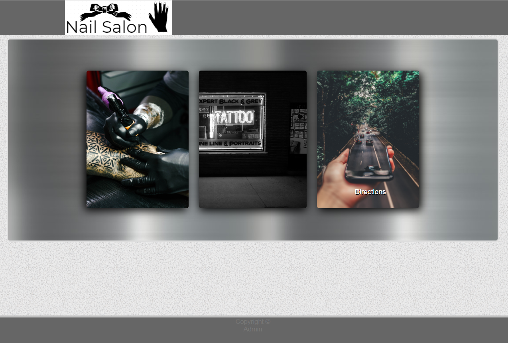

# Nailsalon

## Features

As a customer:  

1. View and create Appointments.

  

2. View services.

  

3. View an embeded Google Map.

  

As an admin:    

1. Update business info.
1. View, confirm, and delete appointments.
1. Add, update price of, and delete services.
1. Add or delete bookable timeslots.

# Setup 

You will need heroku to deploy the website and a Google API key to use an embeded Google Map.

To use Nailsalon you'll need to:

1. fork this repo.
2. add the forked repo to your heroku project.
3. go to your deployed website.
4. click "admin."

  

! The first username and password you input will be saved ! Please keep them safe.

  

5. select "admin" from the drop down list.
6. enter the info for your business. 

  

Button1 will be over the "Appointments" button and Button2 will be over the "Services" button.
API is where you'll enter your Google API key. This is needed for directions.

7. select "services" to add, update and delete services.

  

8. select "bookings" to add and delete bookable timeslots.

  

9. select "appointments" to view, update and delete appointments.

  

### Nailsalon is a customizable website.

You can swap out key images for you own.

go to /client/src/assets/images and replace services.png, appoitnments.png or logo.png with your own images. Just keep the file names as they are and try to keep the ratio similar.

## Examples

